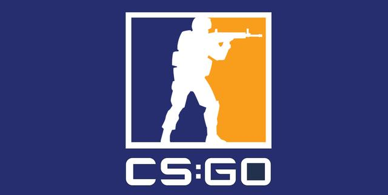

# 游戏的本质

>阅读 Tracy Fullerton, GAME DESIGN WORKSHOP 第2-4章（游戏结构、基本元素、戏剧元素）。选择一款你喜欢的中等规模游戏如“植物大战僵尸体”为案例，根据教材中一个或一组练习要求，回答该游戏的分析与设计问题。
教材中每讲一部分元素，都是给出一段练习或问题，你仅需要回答案例游戏相关的问题。（游戏种类、题材太多，教材研讨的内容不一定会出现在具体游戏之中）
你可以自由选择不同的练习组合，通过这组练习，至少能反映案例游戏的某个方面的设计要点。

## 1. 游戏案例
《counter-strike global offensive》以下简称CSGO。
 

## 2. 游戏要素（基本元素）

### 2.1 思考一个游戏

>思考一个游戏，尽可能详细地描述这个游戏，就像给一个从未玩过这个游戏的人介绍它一样。然后想另一个完全不同类型的游戏，用相同的方法去描述它。最后比较两份描述，有哪些是不同的，哪些是相似的，深入思考每个游戏内在的机制。

1.隐形守护者

互动叙事、角色扮演类冒险游戏。玩家通过扮演剧情中的一个角色，在每个关键节点做出不同的选择来开启不同的剧情，达到不同的分支结局。
入门门槛低，即使是几乎不玩游戏的人也能轻易上手。其特点是丰富的剧情，多样的分线，影视化的呈现以及极强的互动性。

2.CSGO

第一人称射击游戏。玩家分为反恐精英（CT阵营）与恐怖分子（T阵营）两个阵营，双方需在一个地图上进行多回合的战斗，达到地图要求目标或消灭全部敌方则取得胜利。
入门门槛低，但是想要真正体会到其中的乐趣，需要一段时间的学习。特点是较强的竞技性，给玩家带来刺激。

两个游戏的内在机制有很大的不同，隐形的守护者是突出剧情的设计和玩家互动，CSGO的特点在PVP竞技性上。

### 2.2 玩家

自愿地，主动参与并享受这种娱乐方式的个体。自愿，说明玩家是愿意接受游戏设定的规则和限制的，这是“游戏态度”（Bernard Suit定义的Lusory attitude）的一部分，游戏的规则总是用更加困难的、更具有挑战性的方式让玩家达到一个目标（譬如打高尔夫球的目的简单得只是将球放进洞里，但这个游戏就是非要玩家用指定的杆子从几十米外去完成这个目的），而玩家是了解并接受这些规则的。主动参与也是游戏与其他娱乐方式的明显不同点，像演唱会、戏剧，主动参与的往往只是歌手演员，而作为享受的主体观众则是在被动的位置。

玩家角色：反恐精英或恐怖分子。在不同模式中获得胜利的方式不同或相同，可以都是达成击杀目标，也可以是反恐精英阻止恐怖分子完成任务。
玩家的交互模式：PVP。

### 2.3 目标

无论是纸牌游戏还是FPS电子游戏，虽然体验差异很大，但都给玩家设定了游戏的目标。像其他的娱乐，如看书，读者其实并没有特别的目标（除了把书看完），也许小说的主人公会在故事里有自己的目标，但读者是没有的。游戏目标是让玩家深入参与到游戏中的重要手段。
>列举五个游戏，每个游戏一句话，描述他们的目的。

- 狼人杀
  
    尽量使己方阵营的人存活，敌方阵营的人出局。

- 麻将

    尽可能最大番数地胡牌，同时谨慎出牌不要使别人胡牌。

- 隐形守护者

    根据剧情做出不同的选择，体验故事剧情的发展。

- 植物大战僵尸

    合理种植植物攻击僵尸，保护植物，避免僵尸攻击到终点。

- CSGO

    击杀对方玩家，达成获胜目标。 

使用目的为游戏分类：

- capture
    
    这类游戏的目的是毁坏或占有敌对阵营的资源。（地形，资源等等），同时还要避免被杀掉，被侵略。这类游戏属于即使策略类。侵占别人的物品或杀死对手是游戏中根深蒂固的一部分，自古以来就存在。

    例子：象棋、雷神之锤、魔兽争霸

- chase
    
    追捕型游戏的目的是抓捕对手或者躲避对手。

    例子：狐狸与鹅，刺客

- race
    
    在身体或精神上比其他选手先达到目标。

    例子：竞走、棋盘游戏

- alignment
    
    将游戏按一定的空间配置排列，或在不同类别的块之间创建概念上的对齐。

    例子：俄罗斯方块，井字游戏

- rescue or escape
    
    将一个或多个指定单位转移到安全地带。

    例子：超级马里奥

- forbidden act
    
    通过做出一些禁止动作让比赛者打破规则。

    例子：321木头人

- construction
    
    目标是构建、维护或管理对象。可能是在直接竞争或间接竞争的环境中。

    例子：模拟人生

- exploration
    
    目标是探索游戏区域，几乎总是与更具有竞争性的目标相结合。

    例子：EverQuest

- solution
    
    解决一个问题或谜题。
    
    例子：机械迷城

- outwit
    
    以击败别的玩家的方式获取和使用知识。

根据以上分类，CSGO应被定义为capture类游戏。

### 2.4 过程

游戏的过程是玩家在游戏规则允许下的行为，这些行为就是上面提到的更困难、更有挑战性地达到一个目标的行为，而且是在这个特定的游戏背景下的。游戏之外，人要是想把球放进洞里，是不会从几十米外用杆子把球打进去（而且直接用手放进去就好）。

大多数游戏都会有以下几个过程：
Starting action:如何让游戏开始。
Progression of action:在开始动作后进行的过程。
Special action:其他元素或游戏状态可用的条件。
Resolving actions:让游戏结束。

### 2.5 规则

解释游戏中包含的对象和玩家可以做什么和不可以做什么，还阐明了在各种可能出现的情况下会发生什么。

>你能想出一个游戏没有规则吗？有没有游戏只有一个规则的？如果有，描述它。为什么这个练习是困难的。

不能。每个游戏都是有规则的。

### 2.6 资源

游戏内有价值的（让玩家更容易地达成目标）的道具或物品，而且一般是不容易获得的。

资源包括（以CSGO为例）：

- 生命值 

    玩家收到伤害减少生命值，生命值减为0则玩家死亡。
- 防具 
  
  防具会使玩家受到的伤害减少，也会被摧毁。
- 武器
  
  玩家用不同武器造成的伤害不同，武器特性也不同。

- 道具
  
  玩家使用道具可以造成伤害，致盲敌人，或形成烟雾来影响敌方视线。

- 金钱
  
    获胜或输掉一局比赛，玩家会获得多或少的金钱，使用金钱可以购买武器和道具。

- 时间 

    在一些模式中，获胜条件与时间有关。

### 2.7 冲突

规则总是让玩家有难度地达成游戏的目标，这里面规则与目标的关系就构成了游戏的冲突。玩家如何解决这种冲突正是一个游戏的一个典型特征。
过程提供相当低效的手段完成游戏的目标，以此挑战玩家，迫使他们使用特定的技巧。这种过程创造了一种竞争和游戏的氛围，玩家通过挑战这种低效的系统来获得成就感。

游戏中冲突的三个经典来源（以CSGO为例）：

- 障碍

    一些有难度快速到达，但是很关键的地图位置。
- 对手

    其他玩家。
- 困境

    在经济落后的情况下，选择如何购买武器和道具能最有可能逆境取胜。

### 2.8 边界
正如规则一样，游戏界定了玩家物理上或概念上的活动范围，所有的游戏内容都只在这个范围内生效。像雷神之锤里面的3D世界就是游戏的范围；而纸牌游戏里面的范围更加像玩家之间对游戏规则认同的共识，大家在这种共识下进行游戏。

该每个地图玩家可以活动的区域就是CSGO游戏的范围。

### 2.9 结果
游戏最终产生的结果，对于玩家来说是不确定的（在真正完成目标前不知道是否能赢）而且是不一致的（胜负的结果不同），但是可以衡量的（如计算取胜的概率）。结果是玩家进行游戏的一个重要的驱动力，尤其是其不确定性。如果玩家可以预见结果，例如自己肯定赢或输了，就不会想继续进行下去。而玩家会对于这种不确定性的结果投入感情的，这也是游戏设计师需要让游戏做的更好的地方。

CSGO中这种不确定性体现在玩家每一局游戏的发挥、策略、对金钱的计划，等等。

## 3. 使玩家参与进来（戏剧元素）
是什么使一个游戏抓住了玩家的想象力或者有其他原因使玩家沉陷其中？好的游戏能与玩家建立情感上的联结。游戏，本质上使一种娱乐，好的游戏能在情智上感动我们。

### 3.1 挑战性
挑战性能给予玩家不同程度的成就感/失落感，如何平衡玩家的这些情感反应是与玩家建立联系的关键。
需要游戏设计师在挑战与能力之间平衡，以使玩家不至于感到沮丧也不至于感到无聊。

在CSGO中有排位机制，其目的就是为了使玩家与相近水平的玩家游戏，以此保证玩家能感受到挑战性，通过加减排位分数，来动态体现玩家的能力。

### 3.2 玩
玩是玩家对游戏系统最直接的接触，通过它才会与游戏建立联系。但玩本身并不是游戏，只是“Free movement within a more rigid structure”，个人理解是在游戏结构下可以自由发挥做的事情，可以是严肃的（象棋比赛）、竞争激烈的、充满奇幻的等等。

### 3.3 设定

设定将游戏的正规元素包装起来，构建起上下文关系，是让玩家更容易地代入游戏进行选择和交互的重要手段。比如说大富翁（Monopoly）的设定就是让玩家扮演商业大亨进行房地产的交易的游戏，玩家乐于享受这种富有、权力的体验，这也是游戏经久不衰的一个原因。
>描述该游戏的游戏设定。

玩家在游戏中体会枪战的氛围和刺激。

### 3.4 角色(Character)

角色也是让游戏与玩家建立联系的手段，尤其是在角色扮演游戏和电子游戏。玩家通过角色这个代理，在我们精心虚构的背景下体验游戏的过程，解决矛盾。
CSGO中角色一般分为恐怖分子和反恐精英。

