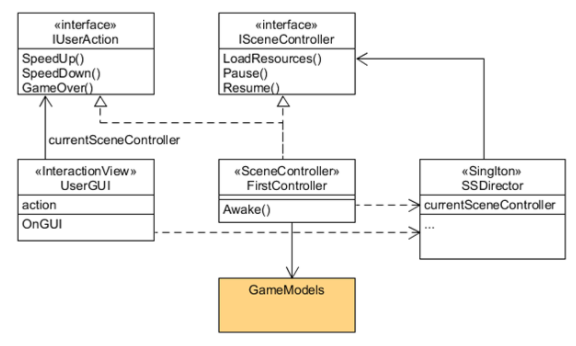

# 抛物线

- 请用三种方法以上方法，实现物体的抛物线运动。（如，修改Transform属性，使用向量Vector3的方法…）
	 1. 直接改变position属性
	

	``` stylus
	this.transform.position += Vector3.left * Time.deltaTime * 100;
	```


	 2. 使用Vector3.MoveTowards
	 

	``` stylus
	this.transform.position = Vector3.MoveTowards (this.transform.position, target, Time.deltaTime);
	```
	3. 使用transform.Translate
	

	``` stylus
	this.transform.Translate (100 * Time.fixedDeltaTime);


# 牧师恶魔过河


## 游戏要求

1. 列出游戏中提及的事物（Objects）
2. 用表格列出玩家动作表（规则表），注意，动作越少越好
3. 请将游戏中对象做成预制
4. 在场景控制器 LoadResources 方法中加载并初始化 长方形、正方形、球 及其色彩代表游戏中的对象。
   使用 C# 集合类型 有效组织对象
5. 整个游戏仅 主摄像机 和 一个 Empty 对象， 其他对象必须代码动态生成！！！ 。 整个游戏不许出现 Find 游戏对象， SendMessage 这类突破程序结构的 通讯耦合语句。
6. 请使用课件架构图编程，不接受非 MVC 结构程序
7. 注意细节，例如：船未靠岸，牧师与魔鬼上下船运动中，均不能接受用户事件！

## 游戏实现

### 游戏中提及的事物（Objects）

左岸和右岸，一艘船，三个牧师，三个恶魔

### 玩家动作表（规则表）

|     玩家动作     |             条件             |     对象动作     |
| :--------------: | :--------------------------: | :--------------: |
|  点击岸上的角色  | 有船在角色一边并且船上有空位 |     角色上船     |
|  点击船上的角色  |                              |     角色上岸     |
|      点击船      |      船上至少有一个角色      | 船前往另一边的岸 |
| 点击重新开始游戏 |                              |   游戏重新开始   |

### 游戏对象做成预制


### LoadResources 方法中加载对象

```c#
boat = new BoatController();
boat.boat = Instantiate(Resources.Load("Prefabs/Boat"), new Vector3(-4, -2, 0), Quaternion.identity) as GameObject;
boat.setName("boat");
```

### 架构图



### MVC程序结构

- 模型（Model）：场景中的所有GameObject
- 控制器（Controller）：接受用户事件，控制模型的变化
  - Director是最高层的控制器，通过一个抽象的场景接口访问不同场景，管理游戏全局状态
  - 一个场景一个主控制器（XXXSceneController，例如 FirstSceneController），管理本次场景所	有的游戏对象，响应外部输入事件
  - 每个游戏对象由其控制器管理（“GameObject”+Controller)
  - 至少实现与玩家交互的接口（IUserAction）
  - 实现或管理运动（Move）
- 界面（View）：显示模型，将人机交互事件交给控制器处理（UserGUI）
  - 处收 Input 事件
  - 渲染 GUI ，接收事件

### 接口

- public interface IUserAction ，定义了大量用户交互接口，定义用户操作，被GUI调用，由SceneController实现
- public interface ISceneController，定义了场景得加载资源等操作，由SceneController实现并且调用

### FirstController

实现两个接口的所有函数，加载游戏对象，调用游戏对象控制器来控制游戏对象

### 游戏对象Controller

实现游戏对象的操作

### Move类

用于实现游戏对象的移动，上船，下船，移动船

## 结果展示


