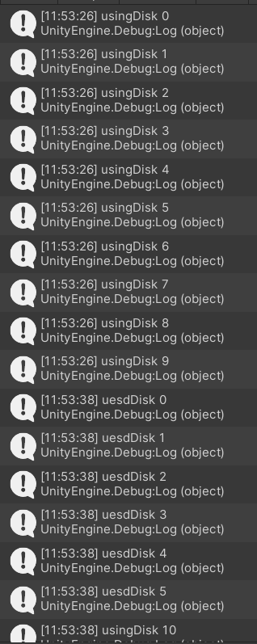

# HitUFO

## 实现要求

编写一个简单的鼠标打飞碟（Hit UFO）游戏

- 游戏内容要求
    + 游戏有多个轮次，每个轮次都包括10个轨迹；
    + 每个轨迹的飞碟的色彩、大小、发射位置、速度、角度、同时出现的
    + 个数都可能不同。它们由该轮次的 ruler 控制；
    + 每个轨迹的飞碟有随机性，总体难度随轮次上升；
    + 鼠标点中得分，计分规则按色彩、大小、速度不同计算，可自由设定

- 游戏要求
  +  使用带缓存的工厂模式管理不同飞碟的生产与回收，该工厂必须是场景单实例的！具体实现见参考资源 Singleton 模板类
  +  近可能使用前面 MVC 结构实现人机交互与游戏模型分离

## 实现细节

是使用MVC结构，实现人机交互与游戏模型分离，再利用动作管理器，实现动作分离

### UserGUI

update处理鼠标输入，设置游戏UI界面

```C#
private void Update(){
    if(Input.GetButtonDown("Fire1")){
        Vector3 position = Input.mousePosition;
        action.Hit(position);
    }
}
```

### FirstController

加载游戏资源

```c#
public void LoadResources(){
    ActionManager = gameObject.AddComponent<CCActionManager>() as CCActionManager;
    this.gameObject.AddComponent<DiskFactory>();
    ruler = new Ruler();
    scoreboard = new ScoreBoard();
    diskFactory = Singleton<DiskFactory>.Instance;
}
```

每一轮游戏的开始，从DiskFactory中取出10个飞碟，放入飞碟队列中

```c#
//飞碟队列
public void EnterDiskQueue(){
    int num = 10;
    for(int i = 0; i < num; i++){
        GameObject Disk = diskFactory.getDisk();
        DiskQueue.Enqueue(Disk);
    }
}
```

从飞碟队列中取出飞碟，ruler设置飞碟队列的飞碟属性，DiskFactory回收飞碟，飞碟交给动作管理器处理飞碟的动作

```c#
//设置当前飞碟属性，并且发射飞碟
public void DiskMove(){
    if(DiskQueue.Count != 0){
        GameObject disk = DiskQueue.Dequeue();
        diskFactory.removeDisk(disk);
        ruler.setDisk(disk, round);
        disk.SetActive(true);
        ActionManager.DiskMove(disk, disk.GetComponent<Disk>().angle, disk.GetComponent<Disk>().power);
    }
}
```

update更新中，先调用EnterDiskQueue获得十个飞碟，然后设置按照时间间隔不停地调用DiskMove发射飞碟，判断当前回合是否获胜能够进入下一回合

```c#
void Update(){
    //判断是否进入下一回合
    if(round != -1 && ruler.IfNextRound(round, scoreboard.score)){
        round++;
        trial = 0;
        EnterDiskQueue();
        userGUI.score = this.score = 0;
        scoreboard.reset();
        userGUI.target = ruler.getTarget(round);
    }
    //没进入下一回合，并且机会次数用完，游戏失败
    else if(round != -1 && !ruler.IfNextRound(round, scoreboard.score) && trial == 11){
        round = -1;
    }

    //飞碟按间隔发射
    if(this.round >= 1){
        if(interval > ruler.setInterval(round)){
            if(trial < 10){
                DiskMove();
                interval = 0;
                trial++;
            }
            else if(trial == 10){
                trial++;
            }
        }
        else{
            interval += Time.deltaTime;
        }
    }
    userGUI.round = this.round;
}
```

Hit判断鼠标点击是否点到了飞碟，通过scoreboard计分板更新分数

```c#
//判断点击飞碟，更新分数
public void Hit(Vector3 position){
    Ray ray = Camera.main.ScreenPointToRay(position);
    RaycastHit[] hits;
    hits = Physics.RaycastAll(ray);
    for(int i = 0; i < hits.Length; i++){
        RaycastHit hit = hits[i];
        if(hit.collider.gameObject.GetComponent<Disk>() != null){
            hit.collider.gameObject.SetActive(false);
            scoreboard.getScore(hit.collider.gameObject);
            userGUI.score = scoreboard.score;
        }
    }
}
```

### ScoreBoard

计分板统计分数，当飞碟颜色为红绿蓝时候，会额外获得分数

```c#
//获取当前得分，当飞碟颜色为红绿蓝时，分数为2
public void getScore(GameObject disk){
    int s = 1;
    if(disk.GetComponent<Renderer>().material.color == new Color(255, 0, 0, 1)){
       s += 1; 
    }
    else if(disk.GetComponent<Renderer>().material.color == new Color(0, 255, 0, 1)){
       s += 1; 
    }
    else if(disk.GetComponent<Renderer>().material.color == new Color(0, 0, 255, 1)){
       s += 1; 
    }
    score += s;
}
```

### Ruler

设置飞碟的各种属性，初始位置，颜色，角度，形状大小，初速度

```c#
//设置飞碟的各种属性
public void setDisk(GameObject disk, int round){
    disk.transform.position = this.setPosition();
    disk.GetComponent<Renderer>().material.color = setColor();
    disk.transform.localScale = setScale(round);
    disk.GetComponent<Disk>().angle = setAngle();
    disk.GetComponent<Disk>().power = setPower(round);
}
```

获取该轮的飞碟发射时间间隔，目标分数，是否能够进入下一轮

```c#
//设置该轮飞碟发射时间间隔，回合越大，时间间隔越小
public float setInterval(int round){
    return (float)(2 - 0.2 * round);
}

//获取这轮的目标分数，回合越大，目标分数要求越高
public int getTarget(int round){
    if(round != -1){
        return 5 + round > 10 ? 10 : 5 + round;
    }
    return 0;
}

//判断是否进入能够下一轮
public bool IfNextRound(int round,int score){
    if(round != -1 && score >= (5 + round > 10 ? 10 : 5 + round)){
        return true;
    }
    return false;
}
```

### DiskFactory

飞碟工厂中有来两个队列，一个是正在使用的队列UsingDisk，一个是已经被使用过的队列，UsedDisk，这两个队列实现飞碟资源的生产和回收

```c#
public GameObject Disk;
private List<GameObject> UsingDisk = new List<GameObject>();   //正在使用的飞碟
private List<GameObject> UsedDisk = new List<GameObject>();    //已经使用过的飞碟
int Index;
```

Awake获取飞碟的prefab

```c#
private void Awake(){
    Disk = GameObject.Instantiate<GameObject>(Resources.Load<GameObject>("Prefabs/Disk"), Vector3.zero, Quaternion.identity);
    Disk.name = "prefab";
    Disk.AddComponent<Disk>();
    Disk.SetActive(false);
    Index = 0;
}
```

获取飞碟，当UsedDisk队列为空时，获取新的飞碟，设置名字为Index，UsingDisk队列入队新的飞碟；当UsedDisk队列不为空时，新的飞碟为UsedDisk出队的飞碟，UsingDisk队列入队新的飞碟。

```C#
//获取新的飞碟
public GameObject getDisk(){
    GameObject NewDisk = null;
    if(UsedDisk.Count > 0){
        NewDisk = UsedDisk[0].gameObject;
        UsedDisk.Remove(UsedDisk[0]);
        UsingDisk.Add(NewDisk);
        Debug.Log("uesdDisk " + NewDisk.name);
    }
    else{
        NewDisk = GameObject.Instantiate<GameObject>(Disk, Vector3.zero, Quaternion.identity);
        NewDisk.name = Index.ToString();
        UsingDisk.Add(NewDisk);
        Index++;
        Debug.Log("usingDisk " + NewDisk.name);
    }
    return NewDisk;
}
```

回收飞碟，将回收的飞碟从UsingDisk出队，UsedDisk入队

```c#
//回收使用过的飞碟
public void removeDisk(GameObject obj){
    if(obj != null){
        obj.SetActive(false);
        UsingDisk.Remove(obj);
        UsedDisk.Add(obj);
    }
}
```

根据Debug输出，可以判断飞碟工厂的生产和回收功能是否实现



可以看到，一开始生产了0-9的新飞碟，然后第二轮回收了0-5的旧飞碟，生产了10-13的新飞碟，第三轮回收了6-9，0-1的旧飞碟，生产了14-17的新飞碟。所以飞碟工厂的生产和回收功能实现了。

### Singleton

面向对象的游戏编程，运用模板，可以为每个MonoBehaviour子类创建一个对象的实例

```c#
public class Singleton<T> : MonoBehaviour where T : MonoBehaviour{
	protected static T instance;

	public static T Instance{
		get{
			if(instance == null){
				instance = (T)FindObjectOfType(typeof(T));
				if(instance == null){
					Debug.LogError("An instance of " + typeof(T) + " is needed in the scene, but there is none.");
				}
			}
			return instance;
		}
	}
}
```

通过调用，可以获得飞碟工厂对象

```c#
public DiskFactory diskFactory;  //飞碟工厂，用于回收飞碟
diskFactory = Singleton<DiskFactory>.Instance;
```

### 动作管理器

ISSActionCallback为动作接口

SSAction为动作父类，规定所有Action的属性和方法

SSActionManager为动作管理器，管理Action List中的每个Action。

### DiskMoveAction

继承自SSAction，规定了一个Disk的动作，动作即飞碟的移动，由两个参数决定：受力角度和受力大小。

```c#
//获得飞碟移动初速度和角度
public static DiskMoveAction GetSSAction(float angle, float power){ 
    DiskMoveAction DiskMove = CreateInstance<DiskMoveAction>();
    DiskMove.InitialSpeed = Quaternion.Euler(new Vector3(0, 0, angle)) * Vector3.right * power;
    return DiskMove;
}

public override void Update(){
    time += Time.fixedDeltaTime;
    AcceleratedSpeed.y = 0; 
    transform.position += (InitialSpeed + AcceleratedSpeed) * Time.fixedDeltaTime;
    angle.z = Mathf.Atan((InitialSpeed.y + AcceleratedSpeed.y) / InitialSpeed.x) * Mathf.Rad2Deg;
    transform.eulerAngles = angle;
    
	//飞碟飞出画面，消除飞碟
    if(this.transform.position.y < -10 || this.transform.position.y > 10){
        this.destroy = true;
        this.callback.SSActionEvent(this);
    }
}
```

### CCActionManager

SSActionManager的子类，封装了操作Action的相关类的函数，使得FirstController调用起来更简洁。

```c#
public class CCActionManager : SSActionManager{
    public DiskMoveAction move;                           
    public FirstController scene_controller;            

    protected void Start(){
        scene_controller = (FirstController)SSDirector.GetInstance().currentSceneController;
        scene_controller.ActionManager = this;
    }
    
    public void DiskMove(GameObject disk, float angle, float power){
        move = DiskMoveAction.GetSSAction(angle, power); 
        this.RunAction(disk, move, this);
    }
}
```

