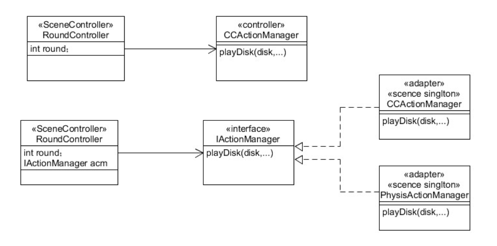

# HitUFO2

## 实现要求

改进飞碟（Hit UFO）游戏：

- 游戏内容要求：
  + 按下面adapter模式设计图修改飞碟游戏
  + 使它同时支持物理运动与运动学（变换）运动



## 实现细节

不使用动作分离的设计，改为Adapter设计模式，物理引擎类PhysicalActionManager实现接口IActionManager，通过这个接口FirstController能够调用物理引擎实现物体的运动。其他实现与之前相同，不需要修改

### IActionManager

```c#
public interface IActionManager
{
    void DiskMove(GameObject disk, float angle, float power);
}
```

### PhysicalActionManager

设置飞碟刚体属性

```c#
public void DiskMove(GameObject disk, float angle, float power){
    Vector3 vector = Quaternion.Euler(new Vector3(0, 0, angle)) * Vector3.right * power * 5;
    //飞碟设置刚体属性
    disk.GetComponent<Rigidbody>().velocity = vector;
    disk.GetComponent<Rigidbody>().useGravity = false;
}
```

### FirstController

在LoadResources中加载物理引擎系统

```c#
//加载资源
public void LoadResources(){
    ActionManager = gameObject.AddComponent<PhysicalActionManager>() as IActionManager;
    this.gameObject.AddComponent<DiskFactory>();
    ruler = new Ruler();
    scoreboard = new ScoreBoard();
    diskFactory = Singleton<DiskFactory>.Instance;
}
```

