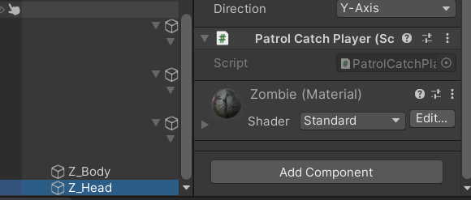

# 3d游戏-智能巡逻兵

## 实现要求

智能巡逻兵

- 游戏设计要求：
  - 创建一个地图和若干巡逻兵(使用动画)；
  - 每个巡逻兵走一个3~5个边的凸多边型，位置数据是相对地址。即每次确定下一个目标位置，用自己当前位置为原点计算；
  - 巡逻兵碰撞到障碍物，则会自动选下一个点为目标；
  - 巡逻兵在设定范围内感知到玩家，会自动追击玩家；
  - 失去玩家目标后，继续巡逻；
  - 计分：玩家每次甩掉一个巡逻兵计一分，与巡逻兵碰撞游戏结束；
- 程序设计要求：
  - 必须使用订阅与发布模式传消息
  - 工厂模式生产巡逻兵

## 实现细节

### 角色预制

玩家：

添加碰撞器和刚体，刚体禁止y方向位置和X，Z方向上的旋转变化，这样可以使玩家发生碰撞时不会摔倒


设置玩家的动画控制器，使用两个变量进行控制，death和pause。


巡逻兵：

添加碰撞器和刚体，刚体禁止y方向位置和X，Z方向上的旋转变化，这样可以使巡逻兵发生碰撞时不会摔倒


添加巡逻兵数据PatrolData类，设置巡逻兵数据；添加PatrolCollide类，可以检测巡逻兵是否发生碰撞，若与玩家进行碰撞，将对玩家进行攻击


```c#
public class PatrolCollide : MonoBehaviour{
    //巡逻兵碰撞触发器
    void OnCollisionEnter(Collision collision){
        //巡逻兵与玩家碰撞，进行攻击
        if(collision.gameObject.tag == "Player"){
            this.GetComponent<Animator>().SetTrigger("attack");
            Singleton<GameEventManager>.Instance.PlayerCatched();
        } 
        //巡逻兵与墙碰撞
        else{
            this.GetComponent<PatrolData>().isCollided = true;
        }
    }
}
```

往巡逻兵的头部添加一个PatrolCatchPlayer类，检测玩家是否在巡逻兵监视范围内



```c#
public class PatrolCatchPlayer : MonoBehaviour{
    //玩家在巡逻兵范围内触发器
    void OnTriggerEnter(Collider collider){
        if(collider.gameObject.tag == "Player"){
            this.gameObject.transform.parent.GetComponent<PatrolData>().isInRange = true;
            this.gameObject.transform.parent.GetComponent<PatrolData>().player = collider.gameObject;
        }
    }

    //玩家在巡逻兵范围外触发器
    void OnTriggerExit(Collider collider){
        if(collider.gameObject.tag == "Player"){
            this.gameObject.transform.parent.GetComponent<PatrolData>().isInRange = false;
            this.gameObject.transform.parent.GetComponent<PatrolData>().player = null;
        }
    }
}
```

设置巡逻兵的动画控制器，使用两个变量进行控制，attack和pause


### 地图预制

地面添加碰撞器组块，使得角色可以站立在地面上


四个区域分别添加碰撞器作为触发器，再分别添加一个Area类，检测玩家是否进入该区域，并且设置区域id


```c#
public class Area : MonoBehaviour{
    public int area;
    FirstController sceneController;

    //地图触发器，检测玩家是否进入该区域
    void OnTriggerEnter(Collider collider){
        sceneController = SSDirector.getInstance().CurrentSceneController as FirstController;
        if(collider.gameObject.tag == "Player"){
            sceneController.playerArea = area;
        }
        if(collider.gameObject.tag == "Patrol"){
            collider.gameObject.GetComponent<PatrolData>().patrolArea = area;
        }
    }

    //地图触发器，检测巡逻兵是否离开该区域
    void OnTriggerExit(Collider collider){
        if(collider.gameObject.tag == "Patrol"){
            collider.gameObject.GetComponent<PatrolData>().isCollided = true;
        }
    }
}
```

每个墙壁都需要添加刚体和碰撞器组件，刚体禁止发生位置和旋转变化


### 订阅/发布模式

发布者（事件源）/Publisher：事件或消息的拥有者

主题（渠道）/Subject：消息发布媒体

接收器（地址）/Handle：处理消息的方法

订阅者（接收者）/Subscriber：对主题感兴趣的人

发布者与订阅者没有直接的耦合

发布者与订阅者没有直接关联，可以多对多通讯

在MVC设计中，是实现模型与视图分离的重要手段，例如：数据DataSource对象，就是Subject。任何使用该数据源的显示控件，如Grid都会及时更新。

实现代码：

订阅者可以订阅GameEventManager的事件，当其他类调用事件时，会使用GameEventManager的方法发布消息，触发相应事件。

这里我们设置三个事件：玩家逃离巡逻兵，巡逻兵追击玩家，巡逻兵抓捕玩家

```c#
public class GameEventManager : MonoBehaviour{
    //玩家逃离巡逻兵
    public delegate void EscapeAction(GameObject patrol);
    public static event EscapeAction OnEscapeAction;
    public void PlayerEscape(GameObject patrol){
        if (OnEscapeAction != null) {
            OnEscapeAction(patrol);
        }
    }

    //巡逻兵追击玩家
    public delegate void FollowAction(GameObject patrol);
    public static event FollowAction OnFollowAction;
    public void PlayerFollowed(GameObject patrol){
        if (OnFollowAction != null) {
            OnFollowAction(patrol);
        }
    }

    //巡逻兵抓捕玩家
    public delegate void CatchAction();
    public static event CatchAction OnCatchAction;
    public void PlayerCatched(){
        if (OnCatchAction != null) {
            OnCatchAction();
        }
    }
}
```

FirstController订阅事件，并且设置规定处理事件的方法，只要相应事件发生，就会调用设置的方法

```c#
//订阅者
void OnEnable(){
    GameEventManager.OnEscapeAction += OnEscape;
    GameEventManager.OnFollowAction += OnFollow;
    GameEventManager.OnCatchAction += OnCatch;
}

void OnDisable(){
    GameEventManager.OnEscapeAction -= OnEscape;
    GameEventManager.OnFollowAction -= OnFollow;
    GameEventManager.OnCatchAction -= OnCatch;
}

public void OnEscape(GameObject patrol){
    patrolActionManager.PatrolMove(patrol);
    scoreBoard.Record();
}

public void OnFollow(GameObject patrol){
    patrolActionManager.PatrolFollow(player, patrol);
}

public void OnCatch(){
    state = State.lose;
    StopAllCoroutines();
    patrolFactory.PatrolPause();
    player.GetComponent<Animator>().SetTrigger("death");
    patrolActionManager.PatrolStop();
}
```

### 工厂模式生产巡逻兵

巡逻兵数据

```c#
public class PatrolData : MonoBehaviour{
    public bool isInRange;        //玩家是否在巡逻兵范围内
    public bool isCollided;       //巡逻兵是否与物体发生碰
    public bool isFollowing;      //巡逻兵是否在追击玩家
    public int playerArea;        //玩家的区域
    public int patrolArea;        //巡逻兵的区域
    public GameObject player;     
}
```

巡逻兵工厂在地图的四个区域分别创建一个巡逻兵，并且设置巡逻兵动画开始，暂停函数

```c#
public class PatrolFactory : MonoBehaviour{
    public GameObject patrol = null;
    private List<PatrolData> UsingPatrols = new List<PatrolData>(); 

    //创建巡逻兵
    public List<GameObject> CreatPatrols(){
        List<GameObject> patrols = new List<GameObject>();
        float[] pos_x = {-5f, 5f};
        float[] pos_z = {5f, -5f};
        //在四个区域分别创建一个巡逻兵
        for(int i = 0; i < 2; i++){
            for(int j = 0; j < 2; j++){
                patrol = Instantiate(Resources.Load<GameObject>("prefabs/patrol"));
                patrol.transform.position = new Vector3(pos_x[j], 0, pos_z[i]);
                patrol.GetComponent<PatrolData>().patrolArea = i * 2 + j + 1;
                patrol.GetComponent<PatrolData>().playerArea = 4;
                patrol.GetComponent<PatrolData>().isInRange = false;
                patrol.GetComponent<PatrolData>().isFollowing = false;
                patrol.GetComponent<PatrolData>().isCollided = false;
                patrol.GetComponent<Animator>().SetBool("pause", true);
                UsingPatrols.Add(patrol.GetComponent<PatrolData>());
                patrols.Add(patrol);
            }
        }
        return patrols;
    }

    //设置动画条件变量，巡逻兵开始移动
    public void PatrolStart(){
        for (int i = 0; i < UsingPatrols.Count; i++){
            UsingPatrols[i].gameObject.GetComponent<Animator>().SetBool("pause", false);
        }
    }

    //设置动画条件变量，巡逻兵暂停移动
    public void PatrolPause(){
        for (int i = 0; i < UsingPatrols.Count; i++){
            UsingPatrols[i].gameObject.GetComponent<Animator>().SetBool("pause", true);
        }
    }
}
```

### 玩家动作

在UserGUI中读入键盘输入

```c#
private void Update(){
    action = SSDirector.getInstance().CurrentSceneController as IUserAction;
    controller = SSDirector.getInstance().CurrentSceneController as ISceneController;
    if(controller.getState().Equals(State.running)){
        //获取键盘输入，玩家依据输入进行移动
        float x = Input.GetAxis("Horizontal");
        float y = Input.GetAxis("Vertical");
        action.PlayerMove(x, y);
    }
}
```

在FirstController中按照键盘输入，对玩家进行移动

```c#
public void PlayerMove(float x, float y){
    if(x != 0 || y != 0){
        player.GetComponent<Animator>().SetBool("pause", false);
    } 
    else{
        player.GetComponent<Animator>().SetBool("pause", true);
    }
    x *= Time.deltaTime;
    y *= Time.deltaTime;

    player.transform.LookAt(new Vector3(player.transform.position.x + x, player.transform.position.y, player.transform.position.z + y));
    if(x == 0){
        player.transform.Translate(0, 0, Mathf.Abs(y) * 5);
    }
    else if(y == 0){
        player.transform.Translate(0, 0, Mathf.Abs(x) * 5);
    }
    else{
        player.transform.Translate(0, 0, (Mathf.Abs(y) + Mathf.Abs(x)) * 2.5f);
    }
}
```

### 巡逻兵动作

巡逻兵主要有两种动作：随机巡逻移动和发现玩家进行跟随追击

巡逻移动PatrolMoveAction：

当巡逻兵发生碰撞时，向后旋转并且寻找下一个随机位置

```c#
public override void Update(){
    if(SSDirector.getInstance().CurrentSceneController.getState().Equals(State.running)){
        //巡逻兵开始移动
        if(turn == true){
            pos_x = this.transform.position.x + Random.Range(-4f, 4f);
            pos_z = this.transform.position.z + Random.Range(-4f, 4f);
            this.transform.LookAt(new Vector3(pos_x, 0, pos_z));
            this.gameobject.GetComponent<PatrolData>().isCollided = false;
            turn = false;
        }
        float distance = Vector3.Distance(transform.position, new Vector3(pos_x, 0, pos_z));
        if(this.gameobject.GetComponent<PatrolData>().isCollided){
            this.transform.Rotate(Vector3.up, 180);
            GameObject temp = new GameObject();
            temp.transform.position = this.transform.position;
            temp.transform.rotation = this.transform.rotation;
            temp.transform.Translate(0, 0, Random.Range(0.01f, 0.1f));
            pos_x = temp.transform.position.x;
            pos_z = temp.transform.position.z;
            this.transform.LookAt(new Vector3(pos_x, 0, pos_z));
            this.gameobject.GetComponent<PatrolData>().isCollided = false;
            Destroy(temp);
        } 
        else if(distance <= 0.1){
            turn = true;
        } 
        else{
            this.transform.Translate(0, 0, Time.deltaTime);
        }

        //玩家在巡逻兵范围内，巡逻兵开始追随
        if(!data.isFollowing && data.isInRange && data.patrolArea == data.playerArea && !data.isCollided){
            this.destroy = true;
            this.enable = false;
            this.callback.SSActionEvent(this);
            this.gameobject.GetComponent<PatrolData>().isFollowing = true;
            Singleton<GameEventManager>.Instance.PlayerFollowed(this.gameobject);
        }
    }
}
```

追击玩家PatrolFollowAction：

```c#
public override void Update(){
    //巡逻兵追击玩家
    if(SSDirector.getInstance().CurrentSceneController.getState().Equals(State.running)){
        transform.position = Vector3.MoveTowards(this.transform.position, player.transform.position, speed * Time.deltaTime);
        this.transform.LookAt(player.transform.position);
        if(data.isFollowing && (!(data.isInRange && data.patrolArea == data.playerArea) || data.isCollided)){
            this.destroy = true;
            this.enable = false;
            this.callback.SSActionEvent(this);
            this.gameobject.GetComponent<PatrolData>().isFollowing = false;
            Singleton<GameEventManager>.Instance.PlayerEscape(this.gameobject);
        }
    }
}
```

