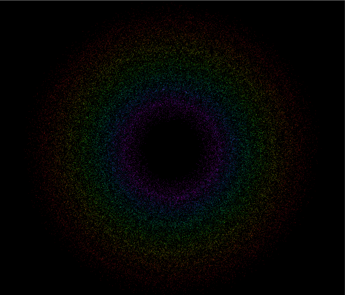

# 七彩光环
## 实现要求
>参考 http://i-remember.fr/en 这类网站，使用粒子流编程控制制作一些效果， 如“粒子光环”

## 实现细节
七彩光环的实现：

因为七个彩虹光环的动作都是相似的，只是旋转方向和颜色不同，因此只要明白其中一个光环是如
何实现的，剩下的就可以仿照完成的光环来实现。

定义结构CirclePosition，用来记录每个粒子的当前半径、角度和时间
```C#
public CirclePosition(float radius, float angle, float time)
    {
        this.radius = radius;
        this.angle = angle;
        this.time = time;
    }
```
定义需要使用的变量：

```C#
    public int count = 10000;       //粒子数量
    public float size = 0.03f;      //粒子大小
    public float minRadius = 5.0f;  //最小半径
    public float maxRadius = 12.0f; //最大半径
    public bool clockWise = true;   //顺时针|逆时针
    public float speed = 2f;        //速度
    public float distance = 0.02f;  //游离范围
    private int tier = 10;  // 速度差分层数 
```


初始化设置：
```C#
void Start () {
        parArray = new ParticleSystem.Particle[count];
        cirPosition = new CirclePosition[count];

        parSystem = this.GetComponent<ParticleSystem>();
        parSystem.startSpeed = 0;       //粒子位置由程序控制
        parSystem.startSize = size;     //设置粒子大小
        parSystem.loop = false;
        parSystem.maxParticles = count; //设置最大粒子量
        parSystem.Emit(count);          //发射粒子
        parSystem.GetParticles(parArray);

        RandomlySpread();               //初始化各粒子位置
    }
```

随机设置粒子出现时的位置，但是位置要在最大半径和最小半径之间：

```C#
void RandomlySpread()
    {
        for (int i = 0; i < count; ++i)
        {   // 随机每个粒子距离中心的半径，同时希望粒子集中在平均半径附近  
            float midRadius = (maxRadius + minRadius) / 2;
            float minRate = Random.Range(1.0f, midRadius / minRadius);
            float maxRate = Random.Range(midRadius / maxRadius, 1.0f);
            float radius = Random.Range(minRadius * minRate, maxRadius * maxRate);

            // 随机每个粒子的角度  
            float angle = Random.Range(0.0f, 360.0f);
            float theta = angle / 180 * Mathf.PI;

            // 随机每个粒子的游离起始时间  
            float time = Random.Range(0.0f, 360.0f);

            cirPosition[i] = new CirclePosition(radius, angle, time);

            parArray[i].position = new Vector3(cirPosition[i].radius * Mathf.Cos(theta), 
                0f, cirPosition[i].radius * Mathf.Sin(theta));
        }

        parSystem.SetParticles(parArray, parArray.Length);
    }
```

最后是设置粒子的旋转：

```C#
void Update()
    {
        for (int i = 0; i < count; i++)
        {
            cirPosition[i].time += Time.deltaTime;
            cirPosition[i].radius += Mathf.PingPong(cirPosition[i].time 
                / minRadius / maxRadius, distance) - distance / 2.0f;
            //parArray[i].color = colorGradient.Evaluate(cirPosition[i].angle / 360.0f);
            if (clockWise)  // 顺时针旋转  
                cirPosition[i].angle -= (i % tier + 1) * (speed / cirPosition[i].radius / tier);
            else            // 逆时针旋转  
                cirPosition[i].angle += (i % tier + 1) * (speed / cirPosition[i].radius / tier);

            // 保证angle在0~360度  
            cirPosition[i].angle = (360.0f + cirPosition[i].angle) % 360.0f;
            float theta = cirPosition[i].angle / 180 * Mathf.PI;

            parArray[i].position = new Vector3(cirPosition[i].radius * Mathf.Cos(theta),
                0f, cirPosition[i].radius * Mathf.Sin(theta));
        }

        parSystem.SetParticles(parArray, parArray.Length);
    }
```

## 最终效果




