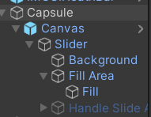
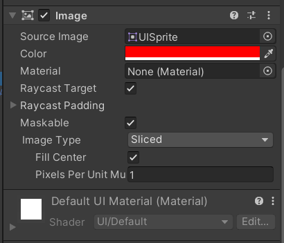

# 3d游戏-血条UI

## 实现要求

血条（Health Bar）的预制设计。具体要求如下

- 使用 IMGUI 和 UGUI 实现
- 使用 UGUI，血条是游戏对象的一个子元素，任何时候需要面对主摄像机
- 分析两种实现的优缺点
- 给出预制的使用方法

## 实现细节

### IMGUI

定义一个HorizontalScrollbar表示血条，使用加减按钮改变血量大小，创建一个空对象，将脚本挂载。

```c#
public class IMGUI : MonoBehaviour{
    public float health = 0f;
    private Rect healthBar;
    public Rect increase;
    public Rect decrease;
    public Slider slider;

    void Start(){
        healthBar = new Rect(50, 50, 200, 30);
        increase = new Rect(75, 80, 40, 30);
        decrease = new Rect(175, 80, 40, 30);
    }

    void OnGUI(){
        if(GUI.Button(increase, "+")){
            health = health + 0.1f > 1f ? 1f : health + 0.1f;
        }
        if(GUI.Button(decrease, "-")){
            health = health - 0.1f < 0 ? 0 : health - 0.1f;
        }
        slider.value = health;
        GUI.HorizontalScrollbar(healthBar, 0f, health, 0f, 1f);
    }
}
```

### UGUI

创建一个 人物，添加Canvas子对象，再添加Slider子对象



选择Handle Slider Area，将其disable。

选择Fill Area的Fill对象，将Image组件的Color属性设置为红色，既可得到血条



往Capsule上添加移动脚本Move，使其可以移动

```c#
public class Move : MonoBehaviour{
    void Start(){}

    void Update(){
        float translationX = Input.GetAxis("Horizontal");
        float translationZ = Input.GetAxis("Vertical");
        MovePlayer(translationX, translationZ);
    }
    
    public void MovePlayer(float translationX, float translationZ){
        translationX *= Time.deltaTime;
        translationZ *= Time.deltaTime;
        this.transform.LookAt(new Vector3(this.transform.position.x + translationX, this.transform.position.y, this.transform.position.z + translationZ));
        
        if(translationX == 0){
            this.transform.Translate(0, 0, Mathf.Abs(translationZ) * 5);
        }         
        else if(translationZ == 0){
            this.transform.Translate(0, 0, Mathf.Abs(translationX) * 5);
        } 
        else{
            this.transform.Translate(0, 0, (Mathf.Abs(translationZ) + Mathf.Abs(translationX)) * 2.5f);
        }  
    }
}
```

给Canvas添加LookAtCamera脚本，使血条一直朝向camera

```c#
public class LookAtCamera : MonoBehaviour{
    void Start(){}

    void Update(){
        this.transform.LookAt(Camera.main.transform.position);
    }
}
```

### 两种实现的优缺点

IMGUI

- 优点：
  - IMGUI方式适合游戏编程
  - IMGUI既避免了 UI 元素保持在屏幕最前端，又有最佳的执行效率
- 缺点：
  - 编码无法直观显示结果，难以进行调试
  - IMGUI实现的血条是二维渲染在屏幕上的，不能随人物运动

UGUI

- 优点：
  - 直观地显示修改结果
  - 设计师能参与程序开发
  - 支持多模式，多摄像机渲染，支持复杂场景
- 缺点：
  - 渲染效率低下

